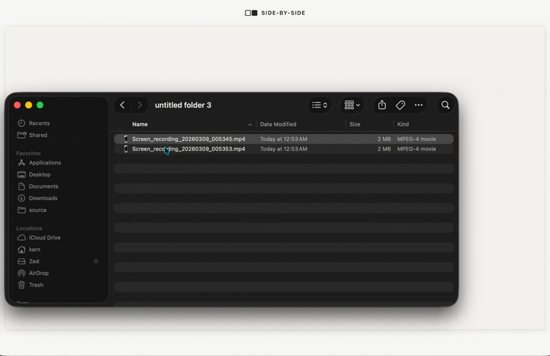

#  □■ Side-by-Side

Showcase before & after videos, side-by-side.

Side-by-Side is a simple tool to align and present before & after videos. Drop in your videos, trim to the right moments, add labels, and export a polished comparison as a video or GIF — all client-side, nothing leaves your browser.

#### GETTING STARTED
No build step or dependencies required. Serve the files with any static file server or open `index.html` directly.

#### USAGE

Drop a before & after video (MP4, WebM, MOV) onto each panel to get started.

**Layout controls**
- **Frame style** — Choose between no frame, phone, or app (macOS window chrome) presentation.
- **Background** — Set a custom background image behind the video panels.
- **Title / Subtitle** — Add editable labels above each video.
- **Padding & Gap** — Drag the edge and divider handles to adjust spacing.

**Playback**
- `Space` — Play / Pause
- **Speed** — Adjust playback speed (0.25x – 2x)
- **Timeline scrubbing** — Hover over the timeline to preview frames. Drag the range handles to set in/out trim points.

**Export**
- `E` — Open the export dialog
- Export the before & after canvas as **WebM**, **MP4**, or **GIF**
- Choose export speed independently from playback speed
- Videos are rendered at 1920x1080 (960x540 for GIF) at 30fps

#### CONTRIBUTING
There are many ways to contribute, you can
- submit bugs,
- help track issues,
- review code changes.
