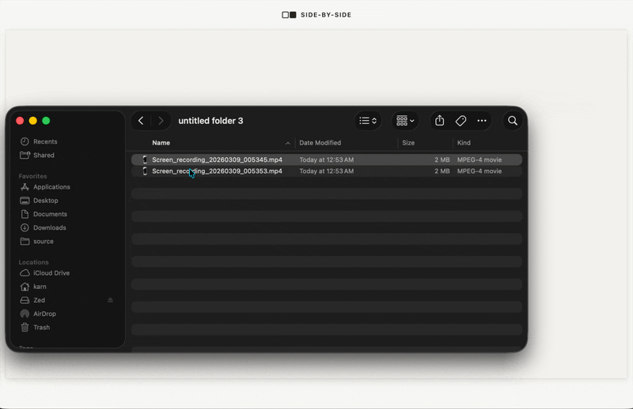

#  □■ Side-by-Side

Showcase before & after videos, side-by-side.

Side-by-Side is a simple tool to align and present before & after videos. Drop in your videos, trim to the right moments, add labels, and export a polished comparison as a video or GIF — all client-side, nothing leaves your browser.

#### GETTING STARTED
No build step or dependencies required. Serve the files with any static file server. For example, run `python3 -m http.server 8000` and open `http://localhost:8000`. Serving over HTTPS or localhost enables offline loading through the service worker.

#### USAGE

Drop a before & after video (MP4, WebM, MOV) onto each panel to get started.

**Layout controls**
- **Frame style** — Choose between no frame, Generic Android, iPhone 17 Pro, or app (macOS window chrome) presentation. The iPhone 17 Pro frame crops videos to its fixed screen aspect ratio.
- **Background** — Set a custom background image behind the video panels.
- **Title / Subtitle** — Add editable labels above each video.
- **Padding & Gap** — Drag the edge and divider handles to adjust spacing.

**Playback**
- `Space` — Play / Pause
- **Speed** — Adjust playback speed (0.25x – 2x)
- **Timeline scrubbing** — Hover over the timeline to preview frames. Drag the range handles to set in/out trim points.

**Export**
- `⌘E` (macOS) / `⊞E` (Windows) — Open the export dialog when the browser receives the shortcut
- Export the before & after canvas as **WebM**, **MP4**, or **GIF**
- Choose export speed independently from playback speed
- Videos are rendered at 1920x1080 (960x540 for GIF) at 30fps

**Saved canvases**
- Open the logo menu to create a new canvas, save the current canvas, or browse recent saves.
- `⌘S` (macOS) / `⊞S` (Windows) — Save the current canvas when the browser receives the shortcut.
- **Save** stores a snapshot of the source videos, background image, layout, labels, trim points, playhead positions, playback speed, and export settings in this browser.
- **Recent saves** reopens or deletes saved snapshots. After the app has loaded once over HTTPS or localhost, saved canvases can be reopened without a network connection.
- Saved canvases use browser storage on this device and may be removed if site data is cleared or the browser evicts it. Large videos may exceed the browser's storage quota.
- Windows may handle `⊞S` and `⊞E` before the browser, opening Search or File Explorer instead.

#### CONTRIBUTING
There are many ways to contribute, you can
- submit bugs,
- help track issues,
- review code changes.
